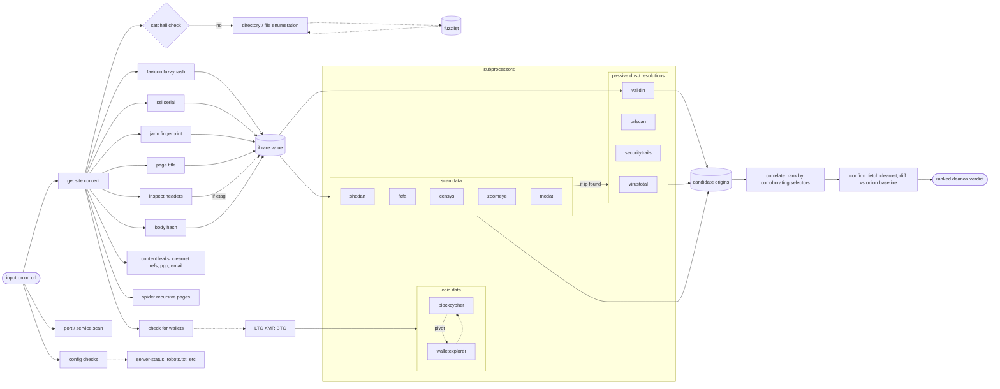

# bebop

---

bebop uncloaks misconfigured web services, helping with many of the mundane tasks involved in revealing the backends of onion services _(Tor)_ and locations fronted by cdn's _(Cloudflare)_



# methods

## core capabilities

- favicon detection & hashing (MurmurHash3, MD5)
- etag detection & correlation
- response header analysis (return rare/interesting headers)
- **Content-Security-Policy (CSP) domain extraction** 🆕
- **CORS origin analysis** 🆕
- **HTTP/2 protocol detection** 🆕
- technology identification (port scanning & service identification)
- **enhanced SSH fingerprinting (SHA256, MD5, banner analysis)** 🆕
- spidering (return samesite, subdomain and external URLs)
- open directory checks
- webpage title extraction
- email extraction
- wallet extraction & balance fetching (xmr,btc,eth)
- certificate trailing (serial lookup)
- **TLS/SSL fingerprinting (cipher suites, cert fingerprints)** 🆕
- **analytics & tracking code extraction (12+ platforms)** 🆕
- **robots.txt & sitemap.xml deep analysis** 🆕

# technicals

## prerequisites

a Tor routable SOCKS5 proxy is required if you are scanning a `.onion` address. to establish one, create your own (see [wiki.archlinux.org](https://wiki.archlinux.org/title/tor)) or follow one of the below options;

1. create a single Tor proxy with [joshhighet/torsocc](https://github.com/joshhighet/torsocc/pkgs/container/torsocc)

    ```shell
    docker run -p9050:9050 ghcr.io/joshhighet/torsocc:latest
    ```

2. if you plan on scaling up scans, see [joshhighet/multisocks](https://github.com/joshhighet/multisocks) to minimise any bottleknecks with hsdir resolutions

    ```shell
    git clone https://github.com/joshhighet/multisocks
    docker compose --file multisocks/docker-compose.yml up --detach
    ```
    
by default, the proxy location is set to `host.docker.internal:9050` - this can be overwrote through environment variables, refer to the `building` section for more

### config checks

[configcheck.py](app/configcheck.py) is an extensible set of page-based checks. the list `interesting_paths` defines various checks

each check should consist of three elements, and will look similar to the below 

```python
{'uri': '/server-status', 'code': 200, 'text': 'Apache'},
```

if the response object is unknown or there is uncertainty with string-matches, use `None` as the value for `text`

  - the URI
  - the expected response status code
  - a string expected within the page source

an entry may also carry `desc` (report label), `method`/`json`/`data`/`headers`
for non-GET probes (GraphQL introspection, Elasticsearch, XML-RPC), and matched
leaks are mined for the origin's real addressing (public IPs, `SERVER_ADDR`,
Prometheus `instance=` labels, internal hostnames) which feed the correlation
layer directly.

### out-of-band callback deanon (⚠ active, opt-in)

[oob.py](app/oob.py) can actively induce the target to connect back to a
listener you control (WordPress XML-RPC `pingback.ping`, or a generic
`--oob-inject` SSRF template); the listener records the origin's real clearnet
egress IP. Enable with `--oob-callback <host>` (or `BEBOP_OOB_*` env vars in
CI). **This is intrusive and can expose you — the callback reveals your
infrastructure to the target, and the Tor anonymity on the probe leg does not
cover the callback leg. Read [OPSEC.md](OPSEC.md) before using it, and only run
it with authorisation.** A copy-pasteable burner setup (self-hosted source-IP
listener + exact secret values for local and GitHub Actions runs) is in
[docs/oob-listener-runbook.md](docs/oob-listener-runbook.md).

### cryptocurrency

field extractions for bitcoin, monero and ethereum - leveraging blockcypher & walletexplorer for balance checks and pivoting

### favicon

[favicon.py](app/favicon.py) will attempt to find a favicon on the webpage

- the favicon discovery will attempt to parse the icon from any HTML, falling back to hardcoded paths
- if found, the favicon is downloaded and an [MurmurHash](https://commons.apache.org/proper/commons-codec/apidocs/org/apache/commons/codec/digest/MurmurHash3.html) is computed
- the hash is searched against the following engines where credentials are provided
`shodan:http.favicon.hash`, `censys:web.endpoints.http.favicons.hash_md5`, `zoomeye:iconhash` & `modat:web.favicon.mmh3`

_to avoid noise, a list of the top 200 favicons have been added to this repository - if a finding is matched, it will not be considered unique - see the housekeeping section for details_

### domain finder

[finddomains.py](app/finddomains.py) attempts to try find domains resolving to a given IP address. it relies on five methods (rDNS, VirusTotal, urlscan, SecurityTrails & Validin). Validin additionally contributes *historical* passive-DNS, so domains that pointed at the origin in the past — but were later moved away — are surfaced as candidates even when they no longer resolve there.

for any domains found, they are resolved over Tor and noted if matching the target

### cert fetcher

[getcert.py](app/getcert.py) will request and parse out SSL information where it exists (alt/common names, issuer, subject, etc)

it will also attempt to discover the SSL serial and if deemed globally rare, poll shodan/censys/zoomeye/fofa for sightings

### headers

[headers.py](app/headers.py) performs comprehensive analysis on response headers with multiple intelligence gathering techniques:

**Basic Header Analysis:**
- `etag` - if a server etag is found, it is searched against threat intel platforms
- `server` - the value for the `Server` HTTP header
- `cookies` - any cookies dropped by the server during the request
- `interesting_headers` - any rare/interesting headers (see [headers.txt](app/common/headers.txt))

**🆕 Advanced Header Analysis:**
- **Content-Security-Policy (CSP) Parsing**: Extracts all external domains from CSP directives (`connect-src`, `script-src`, `style-src`, etc.). Often reveals actual backend API domains that are hidden behind CDNs or Tor.
- **CORS Analysis**: Parses `Access-Control-Allow-Origin` headers to identify cross-origin resource sharing configurations that may reveal related infrastructure.
- **HTTP/2 Detection**: Identifies HTTP protocol version (1.0, 1.1, 2.0) and detects HTTP/2 Server Push via Link headers.
- **Security Headers**: Extracts HSTS, X-Frame-Options, Permissions-Policy, NEL (Network Error Logging), and Report-To headers.
- **Reporting Endpoints**: Discovers backend reporting URLs from CSP-report, NEL, and Report-To headers that may leak infrastructure details.

All discovered domains are automatically queried against Shodan, Censys, and ZoomEye for correlation.

### open directories

[opendir.py](app/opendir.py) is a simple check that attempts to ascertain wether the current pgae is an open directory

the current implementation simply looks for the string `Index of` within a given pages source.

this is used in conjunction with the spider. i.e get all urls, check for directories

### page spider

[pagespider.py](app/pagespider.py) parses the source code of a webpage and returns two objects;

- URL's contained within the source on the same FQDN
- URL's contained within the source on an alternate domain or subdomain
- emails contained within the source

### port scanning

[portscan.py](app/portscan.py) leverages nmap, [proxychains-ng](https://github.com/rofl0r/proxychains-ng) and [yq](https://github.com/kislyuk/yq)

- yq is used to turn the XML outputted by nmap into JSON 🥴
- unless specified only the top ten ports are scanned
- the full command ran can be seen here on [explainshell](https://explainshell.com/explain?cmd=nmap+-sT+-PN+-n+-sV+--version-intensity+3+--script+ssh-hostkey%2Cbanner%2Chttp-title+--script-args+http.useragent%3D%22USERAGENT%22%2Cssh_hostkey%3Dall+--top-ports+20)

a number of nse scripts are used - these include
- [ssh-hostkey](https://nmap.org/nsedoc/scripts/ssh-hostkey.html)
- [banner](https://nmap.org/nsedoc/scripts/banner.html)
- [http-title](https://nmap.org/nsedoc/scripts/http-title.html)
- [ssh-auth-methods](https://nmap.org/nsedoc/scripts/ssh-auth-methods.html)

**🆕 Enhanced SSH Fingerprinting:**
- Extracts SSH host key fingerprints in both SHA256 and MD5 formats
- Identifies SSH key types (RSA, Ed25519, ECDSA, DSS)
- Performs SSH banner analysis to detect software (OpenSSH, Dropbear, libssh, PuTTY, etc.)
- Detects custom or modified SSH banners that may indicate security-conscious operators
- Automatically queries Shodan for matching SSH fingerprints using HASSH and fingerprint databases
- SSH keys rarely change, making them excellent long-term infrastructure identifiers

### title

[title.py](app/title.py) simply parses the site title out of a page. the text you see on a tab ? that thing

### 🆕 analytics & tracking codes

[analytics.py](app/analytics.py) extracts tracking and analytics codes from web pages - a powerful correlation technique as webmasters often reuse the same tracking IDs across clearnet and .onion sites.

**Supported Platforms (12+):**
- **Google Analytics**: UA-XXXXX (Universal Analytics), G-XXXXX (GA4), GT-XXXXX (Google Tag)
- **Google Tag Manager**: GTM-XXXXXX
- **Facebook Pixel**: 15-16 digit pixel IDs
- **Yandex Metrica**: 7-9 digit counter IDs
- **Matomo/Piwik**: Site IDs and tracker URLs (tracker URLs often reveal backend infrastructure)
- **Cloudflare Web Analytics**: 32+ character tokens
- **Hotjar**: Site IDs for session recording/heatmaps
- **Mixpanel**: 32-character project tokens
- **Segment**: Write keys for customer data platform
- **Amplitude**: API keys for product analytics
- **Heap Analytics**: 10-12 digit app IDs
- **Google AdSense**: Publisher IDs (ca-pub-XXXXXXXXXXXXXXXX)

**Correlation Capabilities:**
For each discovered tracking ID, bebop logs search suggestions for:
- **PublicWWW**: Find other websites using the same tracking code
- **BuiltWith**: Technology profiling and website relationship mapping
- **Direct Search**: Google search for the tracking ID

**Real-World Impact:**
Finding the same Google Analytics ID on both a .onion site and a clearnet site creates a direct, verifiable link between the two properties. This is one of the most reliable deanonymization techniques.

### 🆕 TLS/SSL fingerprinting

[tlsfingerprint.py](app/tlsfingerprint.py) performs deep TLS/SSL analysis to create unique server fingerprints.

**Capabilities:**
- **Protocol Version Probing**: Tests support for TLS 1.0, 1.1, 1.2, and 1.3
- **Cipher Suite Analysis**: Extracts server cipher preferences and computes fingerprint hashes
- **Certificate Fingerprinting**: Generates SHA256, SHA1, and MD5 fingerprints of X.509 certificates
- **Weak Configuration Detection**: Identifies outdated protocols, TLS compression (CRIME vulnerability), and other security issues
- **Intelligence Integration**: Automatically queries Shodan, Censys, and ZoomEye for matching TLS fingerprints
- **Tor Support**: Full SOCKS5/Tor routing for fingerprinting .onion services

**Why This Matters:**
TLS configurations are like server fingerprints - they rarely change and can uniquely identify infrastructure across different domains. A matching TLS fingerprint on a clearnet server is strong evidence of the same operator/infrastructure.

**Technical Details:**
- Simplified JA3S-style fingerprinting (cipher suite hashing)
- Certificate persistence tracking
- Protocol downgrade detection
- Per-version cipher preference extraction

### 🆕 robots.txt & sitemap analysis

[robotsmap.py](app/robotsmap.py) performs deep analysis of robots.txt and sitemap.xml files to discover hidden site structure and sensitive paths.

**robots.txt Analysis:**
- **Path Extraction**: Collects all `Disallow` and `Allow` directives
- **Sensitive Path Detection**: Identifies admin panels, APIs, backups, configs, and other interesting paths
- **Comment Mining**: Extracts comments that may contain developer notes or infrastructure hints
- **Sitemap Discovery**: Finds sitemap URLs declared in robots.txt
- **User-Agent Analysis**: Identifies custom bot handling and crawl-delay configurations
- **Pattern Analysis**: Automatically flags paths containing keywords like `admin`, `api`, `backup`, `private`, `secret`, `config`

**sitemap.xml Analysis:**
- **URL Extraction**: Parses all URLs from sitemaps (with metadata like priority, change frequency)
- **Sitemap Index Handling**: Recursively fetches and parses sitemap indexes
- **URL Categorization**: Automatically identifies admin/API/login URLs
- **Sub-sitemap Processing**: Fetches up to 5 sub-sitemaps from sitemap indexes
- **Standard Location Fallback**: Tries `/sitemap.xml` if not found in robots.txt

**Why This Matters:**
robots.txt and sitemaps often reveal the entire site structure including:
- Hidden admin interfaces (`/wp-admin`, `/administrator`, `/panel`)
- API endpoints (`/api/v1/`, `/graphql`)
- Development/staging paths (`/dev`, `/test`, `/staging`)
- Backup files (`/backup.sql`, `/dump.tar.gz`)
- Configuration files (`/.env`, `/config.php`)

These paths are typically not linked from the main site but are exposed through robots.txt for crawler guidance.

# building

_at build time you can inject a custom proxy location with `SOCKS_HOST` & `SOCKS_PORT`_

```shell
git clone https://github.com/joshhighet/bebop
docker build --build-arg SOCKS_HOST=127.0.0.1 --build-arg SOCKS_PORT=9050 bebop -t bebop
```

# running

## external services

if given credentials, censys, shodan & zoomeye can be used to for enrichment, see the above diagram for specific use criteria

_using one, any or all external data repositories is optional and only done when authorisation parameters are explicitly provided_

| Search Provider   | Environment Variable                  | Where to Find                                                                                    |
|-------------------|---------------------------------------|--------------------------------------------------------------------------------------------------|
| Censys            | `CENSYS_PERSONAL_ACCESS_TOKEN` & `CENSYS_ORGANIZATION_ID` | [platform.censys.io](https://platform.censys.io)                          |
| Shodan            | `SHODAN_API_KEY`                      | [account.shodan.io](https://account.shodan.io)                                                   |
| FOFA              | `FOFA_API_KEY`                        | [en.fofa.info](https://en.fofa.info/userInfo)                                                    |
| ZoomEye           | `ZOOMEYE_API_KEY`                     | [zoomeye.ai/profile](https://www.zoomeye.ai/profile)                                             |
| Modat Magnify     | `MODAT_API_KEY`                       | [magnify.modat.io](https://magnify.modat.io)                                                     |
| Validin           | `VALIDIN_API_KEY`                     | [app.validin.com](https://app.validin.com) (Account Settings → Manage API keys)                  |
| urlscan           | `URLSCAN_API_KEY`                     | [urlscan.io/user/profile](https://urlscan.io/user/profile/)                                      |
| VirusTotal        | `VIRUSTOTAL_API_KEY`                  | [support.virustotal.com](https://support.virustotal.com/hc/en-us/articles/115002100149-API)      |
| SecurityTrails    | `SECURITYTRAILS_API_KEY`              | [securitytrails.com/app/account/credentials](https://securitytrails.com/app/account/credentials) |

:note: FOFA does not have a free API tier. All searches require F credits, excluding `icon_hash` searches which require a business plan.

```shell
# if you have already built the image locally
docker run bebop facebookwkhpilnemxj7asaniu7vnjjbiltxjqhye3mhbshg7kx5tfyd.onion
# or to run directly from ghcr
docker run ghcr.io/joshhighet/bebop:latest ciadotgov4sjwlzihbbgxnqg3xiyrg7so2r2o3lt5wz5ypk4sxyjstad.onion
# use -e to inject environment variables, i.e
docker run -e SOCKS_HOST=yourproxy.fqdn -e SOCKS_PORT=8080 -e ZOOMEYE_API_KEY=12345678 -e {any other external service key=values} bebop {...}
# to run directly with python simply have the required environment variables exposed to your shell and run
python3 -m app facebookwkhpilnemxj7asaniu7vnjjbiltxjqhye3mhbshg7kx5tfyd.onion
```

## running with GitHub Actions

You can use GitHub Actions to run the project directly from your browser without setting up a local environment. This is particularly useful for quick scans or when you don't want to set up the required dependencies locally.

### How to Run

1. Go to the "Actions" tab in your repository
2. Select the "bebop" workflow
3. Click "Run workflow"
4. Fill in the required parameters:
   - `web_location`: The URL or .onion address you want to scan
   - `loglevel` (optional): Set to "DEBUG" for verbose output (also generates HTML report)
   - `useragent` (optional): Custom user agent string

**🛡️ Defanged URL Support**: You can safely input defanged URLs (commonly used when sharing IOCs/malicious URLs) and bebop will automatically refang them:
   - `hxxp://example[.]com` → `http://example.com`
   - `hxxps://malware[dot]onion` → `https://malware.onion`
   - `http[:]//site(.)com` → `http://site.com`
   - Supports: `hxxp/hxxps`, `[.]`, `[dot]`, `(.)`, `{.}`, `[://]`, `[:]`, and more

### Environment Variables

The GitHub Actions workflow automatically sets up a Tor proxy for you. If you want to use external services for enrichment, you'll need to add the following secrets to your repository:

1. Go to your repository settings
2. Navigate to "Secrets and variables" → "Actions"
3. Add the following secrets as needed:
   - `CENSYS_PERSONAL_ACCESS_TOKEN`
   - `CENSYS_ORGANIZATION_ID`
   - `FOFA_API_KEY`
   - `FOFA_API_MAIL`
   - `MODAT_API_KEY`
   - `SECURITYTRAILS_API_KEY`
   - `SHODAN_API_KEY`
   - `URLSCAN_API_KEY`
   - `VALIDIN_API_KEY`
   - `VIRUSTOTAL_API_KEY`
   - `ZOOMEYE_API_KEY`

### Output

After the workflow completes:
1. **Download the "bebop-results" artifact** containing:
   - `log.txt` - Complete scan output with all findings
   - `bebop-report.html` - Professional HTML report (when loglevel=DEBUG)
2. The HTML report includes:
   - All HTTP headers with values
   - Discovered file paths with response codes
   - Port scan results with service banners
   - TLS/SSL fingerprints
   - Analytics tracking codes
   - And all other scan results in an easy-to-read format

## subprocessors

you can use [get-api-allowances.py](get-api-allowances.py) to retrieve search query credit balances from the engines you utilise.

```
x:bebop (main*) $ ./get-api-allowances.py
############# ZoomEye
9666 free points, 0 paid points remaining
################ fofa
coins: 0
points: 9666
remaining queries: 0
remaining data: 0
############## Shodan
99 query credits remaining for current month
############## Censys
Platform credentials configured for organization 11111111-2222-3333-4444-555555555555 - view remaining credits at https://platform.censys.io
############## SecurityTrails
used 23 of 50 avail credits for current month
############## urlscan.io
used 0 out of 120 avail credits for current minute
used 0 out of 1000 avail credits for current hour
used 11 out of 1000 avail credits for today
############## VirusTotal
used 23 out of 500 avail credits for today
used 0 out of 240 avail credits for current hour
used 23 out of 1000000000 avail credits for current month
############## Modat Magnify
487 of 500 searches remaining, 48213 of 50000 results remaining
```

# housekeeping

to avoid consuming unneccesary credits polling subprocessors a list of common results for a few tasks are stored as text files within this repo.

this includes a list of the top 1000 favicon fuzzyhashes, top 1500 ssl serials and the top 1000 server titles - if a match is found against these, it's unlikely to be a useful enough data-point to bother polling the likes of shodan, censys, zoomeye, and fofa for

these files should be updated every now and then. to do so, run the following

```shell
# for favicons
shodan stats --facets http.favicon.hash:1000 port:80,443 \
| grep -oE '^[-]?[0-9]+' \
> common/favicon-hashes.txt
echo 0 >> common/favicon-hashes.txt
# for http titles
shodan stats --facets http.title:1000 port:80,443 \
| grep -oE '^[^0-9]+' \
| sed -r 's/^[[:space:]]+//;s/[[:space:]]+$//' \
| sed '/^[[:space:]]*$/d' \
> common/http-titles.txt
echo '404 Error Page' >> common/http-titles.txt
# for x509 serials
shodan stats --facets ssl.cert.serial:2000 port:443,8443 \
| grep -o '^[^ ]*' \
| sed '/Top/d' \
> common/ssl-serials.txt
```

testcases are a work in progress but can be ran with 

```shell
python3 -m unittest discover -s tests
```

# acknowledgments

This project was originally developed by [Josh Highet](https://github.com/joshhighet). We are grateful for the excellent work and the foundation that made this tool possible. The original repository can be found at [joshhighet/bebop](https://github.com/joshhighet/bebop).

Thank you for creating such a powerful and useful tool for web service reconnaissance and security assessment.
